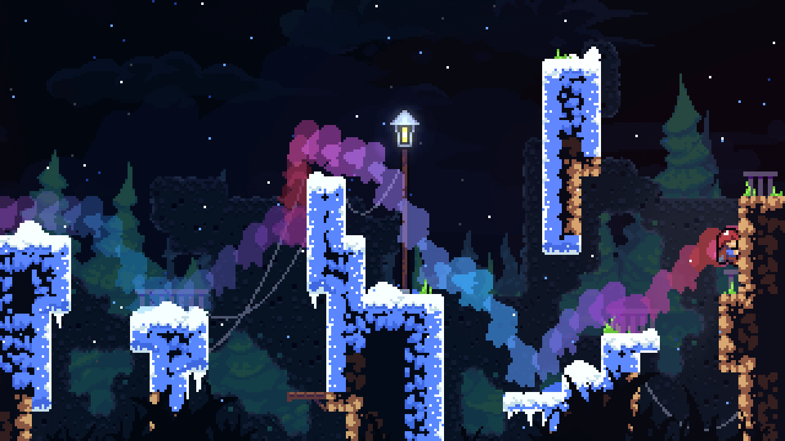
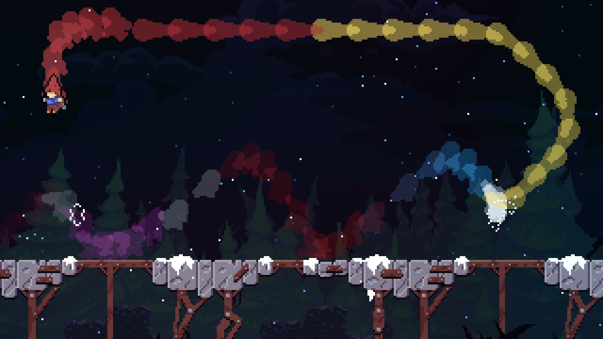
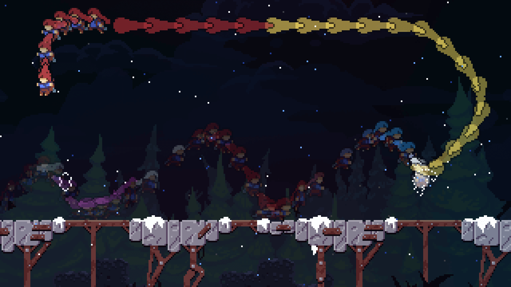
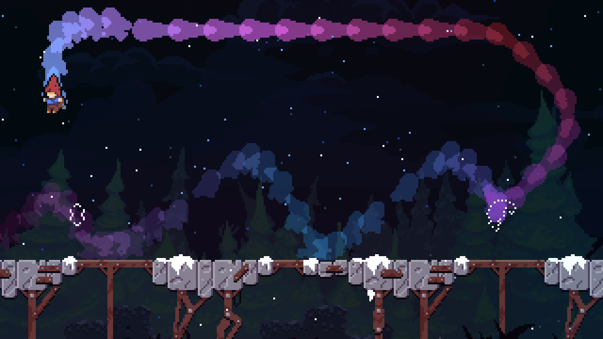
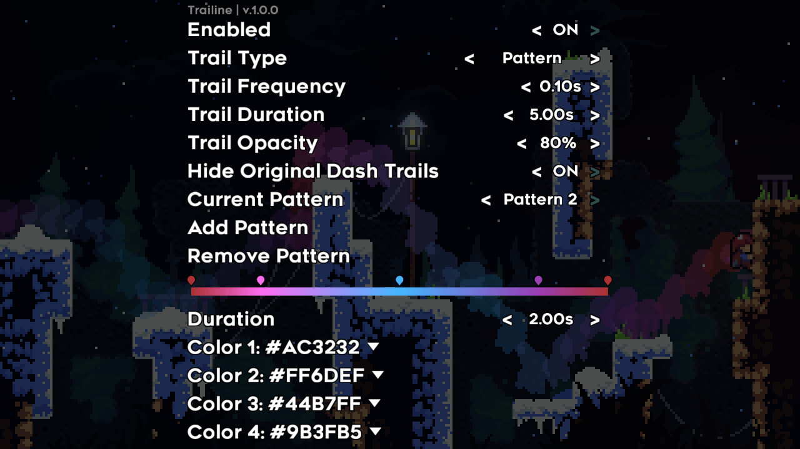

# Trailine

---

This mod allows you to customize Madeline's trails, including frequency, duration, opacity, and more.

Three trail types are supported:

- Hair Color: The trail's color will follow Madeline's hair, like the playback ghosts in Farewell.
  
- [Onion Skin](https://en.wikipedia.org/wiki/Onion_skinning): The trail will use Madeline's sprite instead of an outline with color.
  
- Pattern: The trail's color will follow the current pattern in mod options.
  

Settings:

## Installing

You can download the latest version on [GameBanana](https://gamebanana.com/mods/349341) or [GitHub releases](https://github.com/WEGFan/Celeste-Trailine/releases).

[Everest](https://everestapi.github.io/) is required to enable modding for Celeste.
